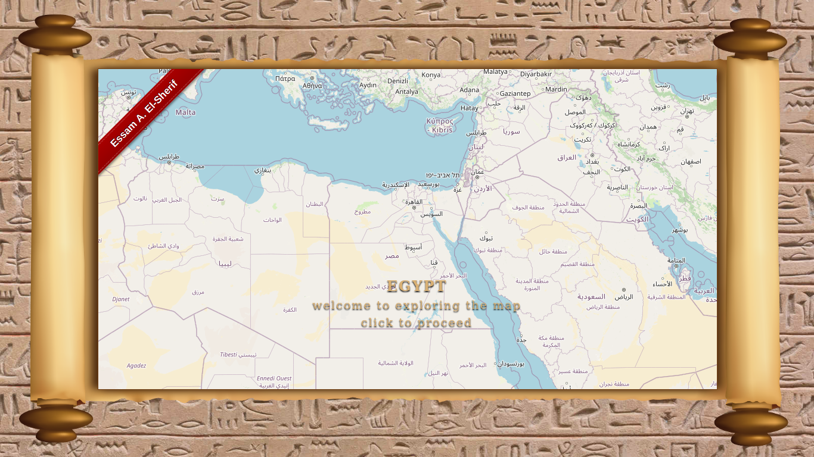
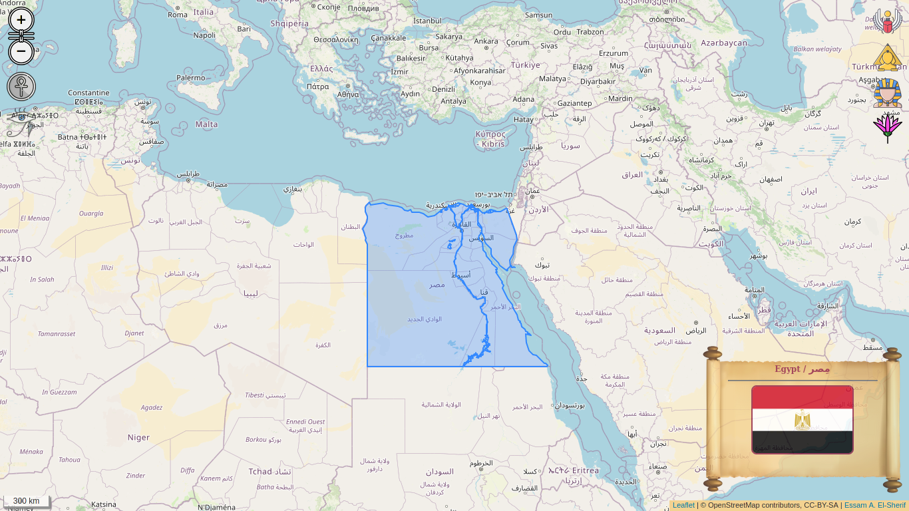

# gis.egypt

A web map developed using [Leaflet.JS](https://leafletjs.com/index.html "Leaflet.JS"), an open-source JavaScript library for interactive maps. The web map provides detailed information about Egypt's administration boundaries and population.

## References

* [Leaflet.JS](https://leafletjs.com/index.html "Leaflet.JS") an open-source JavaScript library for interactive maps.
* [Leaflet.JS Theme Controls](https://github.com/essamatefelsherif/Leaflet.themeControls "Leaflet.JS Theme Controls") a plugin that extends Leaflet native map controls in order to customize the on-screen shape of the map.
* [Leaflet.JS Splash](https://github.com/essamatefelsherif/Leaflet.Splash "Leaflet.JS Splas") using splash screens to provide descriptive information about your map prior to loading the Leaflet full map screen.

## Supported Leaflet Versions

This plugin was tested against [Leaflet.JS](https://leafletjs.com/index.html "Leaflet.JS") versions greater than 1.0, up to 1.7.1.

## License

This web map is licensed under the MIT license, see the [LICENSE](./LICENSE "LICENSE") file.
